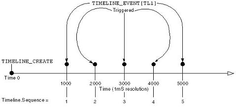

# Timeline Functions

NetLinx Timeline functions provide a mechanism for triggering events based upon a sequence of times.
The sequence of times is passed into the timeline functions as an array of LONG values, with each
value representing a time period (in milliseconds) that is either relative to the start time of the
timeline or to the previously triggered event. Timelines provide the capability to dynamically set
up a timed sequence, providing a mechanism to modify the sequence, and allow the user to create,
delete, and modify sequences.

Timelines are represented by the illustration below:



-   When the [TIMELINE_CREATE](TIMELINE_CREATE.md) function is executed, the timeline starts at zero
    and begins counting. When the timer value equals a value in the TIMES array, a
    [TIMELINE_EVENT](TIMELINE_EVENT.md) is triggered.
-   Within the timeline event, a TIMELINE structure is available to get information about the
    specific time from the TIMES array that generated the event.
-   When a relative timeline is created, the NetLinx Master converts the provided relative times
    into absolute times that are stored internally.

The TIMELINE structure contains the following members:

```c linenums="1"
STRUCTURE TIMELINE
{
    INTEGER       ID             //user supplied ID
    INTEGER       SEQUENCE       //index in Times array
    LONG          TIME           //time since start of timeline
    INTEGER       RELATIVE       //0=absolute 1=relative
    LONG          REPETITION     //# of loops for repeating timeline
}
```

Each TIMELINE data member is defined as follows:

|              |                                                                                                                                                                                                                                                                                                                                                      |
| ------------ | ---------------------------------------------------------------------------------------------------------------------------------------------------------------------------------------------------------------------------------------------------------------------------------------------------------------------------------------------------- |
| `ID`         | The ID that the user assigned to the timeline in the TIMELINE_CREATE function. <br> Click here for details on timeline IDs.                                                                                                                                                                                                                          |
| `SEQUENCE`   | The index of the time in the Times array that was passed to the TIMELINE_CREATE function. The SEQUENCE data member is used to determine what action to take for the event and is normally decoded with a SWITCH/CASE structure (as shown in the example below).                                                                                      |
| `TIME`       | The amount of time that has elapsed since the timeline started. <br> For repeating Timelines, the TIME and REPETITION data members can be used to calculate the total amount of time it has been running.                                                                                                                                            |
| `RELATIVE`   | If the timeline is operating in relative mode, this data member is equal to TIMELINE_RELATIVE. If the timeline is absolute, it is equal to TIMELINE_ABSOLUTE.                                                                                                                                                                                        |
| `REPETITION` | If the timeline was created with TIMELINE_REPEAT, this data member holds the number of times the timeline has been executed. REPETITION contains zero for the first pass through the timeline. <br> Thus, the calculation to determine the total amount of time the timeline has been running is simply: <br> `TIMELINE.TIME * TIMELINE.REPETITION`. |

## Returns

|     |                                                                 |
| --- | --------------------------------------------------------------- |
| `0` | Successful                                                      |
| `1` | Timeline ID already in use                                      |
| `2` | Specified array is not an array of LONGs                        |
| `3` | Specified length is greater than the length of the passed array |
| `4` | Out of memory                                                   |

## Example

```c linenums="1"
DEFINE_VARIABLE
LONG TimeArray[100]

DEFINE_CONSTANT
TL1 = 1
TL2 = 2

DEFINE_EVENT
TIMELINE_EVENT[TL1] // capture all events for Timeline 1
{
    switch(Timeline.Sequence) // which time was it?
    {
        case 1: { SEND_COMMAND dvPanel,"'TEXT1-1 1'"  }
        case 2: { SEND_COMMAND dvPanel,"'TEXT1-1 2'"  }
        case 3: { SEND_COMMAND dvPanel,"'TEXT1-1 3'"  }
        case 4: { SEND_COMMAND dvPanel,"'TEXT1-1 4'"  }
        case 5: { SEND_COMMAND dvPanel,"'TEXT1-1 5'"  }
    }
}

TIMELINE_EVENT[TL2]
{
    switch(Timeline.Sequence)
    {
        case 1: { SEND_COMMAND dvPanel,"'TEXT2-2 1'"  }
        case 2: { SEND_COMMAND dvPanel,"'TEXT2-2 2'"  }
        case 3: { SEND_COMMAND dvPanel,"'TEXT2-2 3'"  }
        case 4: { SEND_COMMAND dvPanel,"'TEXT2-2 4'"  }
        case 5: { SEND_COMMAND dvPanel,"'TEXT2-2 5'"  }
    }
}

DEFINE_PROGRAM
PUSH[dvPanel,1]
{
    TimeArray[1] = 1000
    TimeArray[2] = 2000
    TimeArray[3] = 3000
    TimeArray[4] = 4000
    TimeArray[5] = 5000
    TIMELINE_CREATE(TL1, TimeArray, 5, TIMELINE_ABSOLUTE,TIMELINE_REPEAT)
}

PUSH[dvPanel,2]
{
    TimeArray[1] = 1000
    TimeArray[2] = 1000
    TimeArray[3] = 1000
    TimeArray[4] = 1000
    TimeArray[5] = 1000
    TIMELINE_CREATE(TL2, TimeArray, 5, TIMELINE_RELATIVE, TIMELINE_ONCE)
}
```

The example above creates two Timelines (TL1 and TL2) that trigger events at the same rate (once per
second).

-   TL1 uses TIMELINE_ABSOLUTE to specify that the times in TimeArray are absolute with respect to
    the start of the timeline. Since TL1 specifies the TIMELINE_REPEAT, it is also repeating and
    will generate a TIMELINE_EVENT every second iterating through all five times in a round-robin
    fashion: 1,2,3,4,5,1,2,3,4,5,1,2,3, and so on.
-   TL2 uses TIMELINE_RELATIVE to specify that the times in TimeArray are relative to each other
    (i.e. each events occurs 1000 milliseconds after the previous). Since TL2 specifies the
    TIMELINE_ONCE parameter, it will execute the entire timeline once, then stop: 1,2,3,4,5.

## See Also

-   [TIMELINE IDs](TIMELINE_IDs.md)
-   [TIMELINE Example](TIMELINE_example.md)
-   [TIMELINE Keywords](TIMELINE_Keywords.md)
