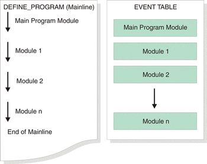

# NetLinx Modules

The ability to reuse code is a desirable goal in software development; however, code reuse takes
careful planning and organization. NetLinx provides tools such as functions and modules to promote
reusability.

Modules are NetLinx sub-programs designed to be "plugged into" a main program.

Technically, modules can contain declarations to other modules, provided that no circular references
are involved. However, because different instances of the same module must not be separated by
instances of a different module, it is highly recommended that you do not declare modules from
within other modules if you have multiple declarations of the parent module they will then be
separated by the declarations of the child module.

When using modules, always keep the order of usage in mind. The modules must be placed (in the
program code) in the order in which you want them to occur.

## Select a Help Topic

-   [Defining a Module](Defining_a_Module.md)
-   [Module Keywords](Module_Keywords.md)
